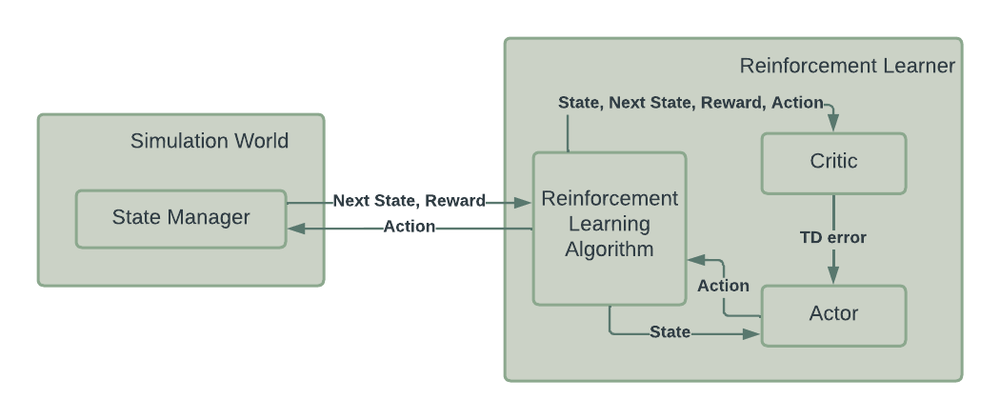
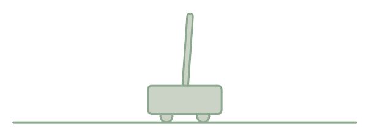

# General Purpose Reinforcement Learning using Actor-Critic

General Purpose Reinforcement Learning library for solving a wide range of problems. This Reinforcement Learning system is implemented using the Actor-Critic model. The Actor uses a policy to perform actions, while the Critic uses the performed actions train the Actor's policy. This lets the Actor train its policy over time, and make better decisions as it learns to solve a problem.

Both the Actor and the Critic can be implemented using either a table-based or a neural-net-based approach. In this system, only the Critic supports both these implementations, while the Actor is allways table-based. This limits the complexity of the problems the system can learn and solve, but for simple problems like the ones described below, this is not an issue.

For testing the system's learning capabilities, three toy problems are implemented:

- Pole Balancing
- Towers of Hanoi
- Gambler

## Toy Problems

### Pole Balancing

The Pole Balancing problem, also known as the [Inverted Pendulum](https://en.wikipedia.org/wiki/Inverted_pendulum), consists of a pole balancing on top of a cart. The cart can roll freely and the pole can rotate freely around the point at which it is resting on the cart. Due to gravity, the pole will fall, and the goal is to keep the pole balanced by only pushing the cart left or right.

### Towers of Hanoi

The [Towers of Hanoi](https://en.wikipedia.org/wiki/Tower_of_Hanoi) is a famous AI problem consisting of three pegs with a number of discs stacked on it. The discs are stacked in ascending order from largest to smallest. The goal is to move the whole tower to another peg, only by moving one disc at a time. Additionally, a peg may only be placed on top of a larger peg during the game.

### Gambler

The Gambler toy problem is a simple problem involving a gambler betting money on a biased coin. The gambler starts out with a random number of coins between 0 and 100, where the goal is to reach 100 coins. Each round, the gambler can bet any number of coins it has available. If successful, it receives twice the betted amount. The probability of winning the coin flip is usually set to less than 50% in this game.

## Usage

To run this program, download or clone the repository and run `gprl_system.py` using Python 3.9 or higher. As of writing this text, Tensorflow does not support Python 3.10 or higher.

## Requirements

- Python 3.9 or higher
- Tensorflow
- Numpy
- Matplotlib
- Configparser

`pip install tensorflow numpy matplotlib configparser`

## Configuration

Most settings, such as which toy problem to use or how long to train, can be changed in the config files. Examples for config files can be found in [`configs/`](configs/).

The syntax of the config files is identical to Windows' .ini-files' syntax, where variables are defined on separate lines with an equals-sign separating the variable and the value.

In the __Globals__ section of the config we find the following settings:

- __problem__: The toy problem to play, either 'cartpole', 'hanoi' or 'gambler'
- __episodes__: Number episodes to play/train the agent for
- __max_steps__: Max number of actions before an episode is forcefully ended
- __table_critic__: Whether to use a table- or neural-net-based critic
- __epsilon__: Probability for picking a completely random move
- __actor_lrate__: Learning rate for the actor
- __critic_lrate__: Learning rate for the critic
- __trace_decay__: Eligibility trace, the rate at which trace decays/falls
- __drate__: Discount rate of epsilon
- __verbose__: How much to print to the terminal during training
- __seed__: Seed for the RNG, can be removed to get random seed each run
- __nn_dims__: Shape of the neural network in the NN-based critic

Additionally there are some problem-specific configurations:

For the __Pole Balancing__ problem:

- __lenght__: Length of the pole
- __pole_mass__: Mass of the pole
- __gravity__: Acceleration from gravity (up is positive), normally -9.8
- __timestep__: Elapsed time between actions

For the __Towers of Hanoi__ problem:

- __num_pegs__: Number of pegs
- __num_discs__: Number of discs

For the __Gambler__ problem:

- __win_prob__: Probability of winning the coin flip, number in range (0, 1)

## Results

### Pole Balancing

The agent usually learns to solve the pole balancing problem after around 50 episodes. In this case, 'solving' the problem means surviving for at least 300 simulation steps (300 actions).

### Towers of Hanoi

For all configurations of the Towers of Hanoi (number of pegs, number of discs) there exists an optimal solution. In this system, with number of discs less than 5, the agent learns the optimal solution reasonably fast. For example with three pegs and four discs, it takes around 120 episodes to learn the optimal solution.

### Gambler

The learning capabilities for the gambler problem is somewhat harder to see. With the optimal solution, the agent goal should be to get the amount of coins to the closest multiple of 25, and then bet all its coins until it either ends up with 0 coins or with 100 coins. After training the RL-system on this problem, the agnent's action for each state was plotted showing some learning. There were visible peaks around the multiples of 25, while other states the agent betted much lower amounts.

## License

This code is protected under the [GNU General Public License 3.0](http://www.gnu.org/licenses/gpl-3.0.html)
